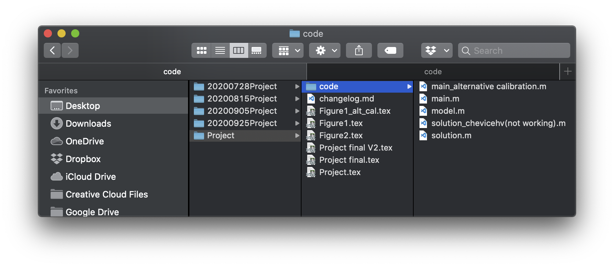
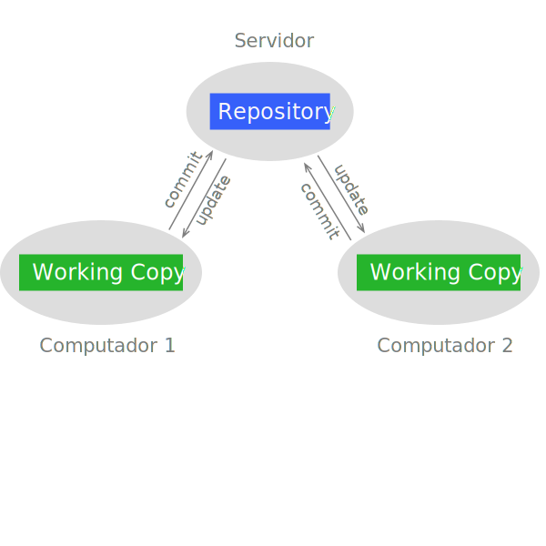
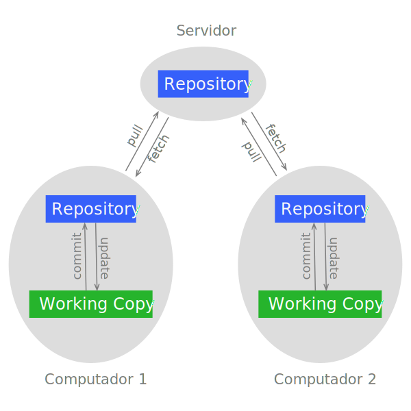
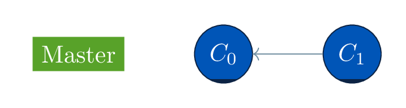
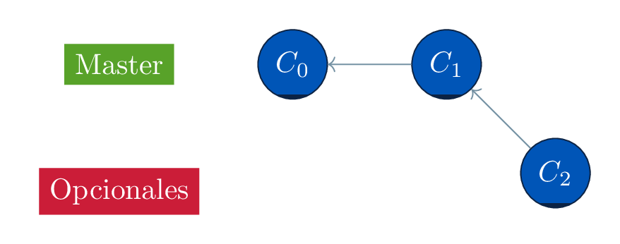
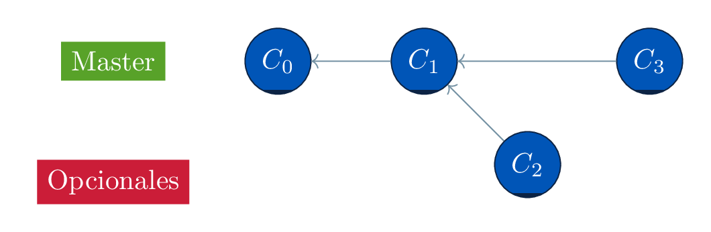
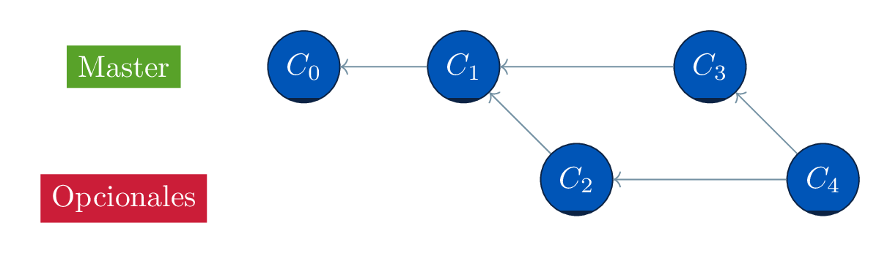
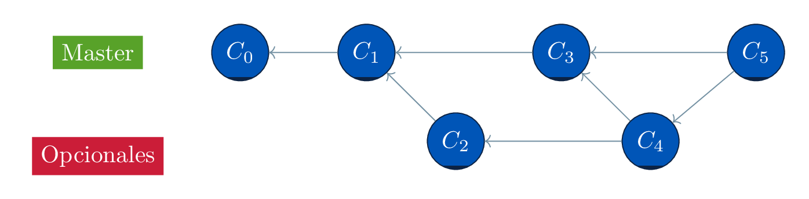

# Git  para economistas

La idea de este repositorio es documentar los beneficios del uso de *Git* y *GitHub* en ciencias sociales. La documentación esta diseñada para que personas sin experiencia previa entiendan las ventajas de este sistema de control de versión y tengan una idea de cómo incorporarlo en su estructura de trabajo. Debería ser fácil para el usuario entender los alcances para el desarrollo de cualquier aplicación que utilice archivos de texto como insumo.

Es importante entender que los sistemas de control de versión no sustituyen la buena organización personal y grupal. Las malas prácticas que mantenemos en nuestra vida digital tienden a replicarse usando Git, y sus consecuencias pueden empeorar si los usuarios no son consientes de ellas. No existe una estrategia única para evitar esto: claramente depende del tipo de proyecto en el que se trabaje (e.g. no es lo mismo trabajar de a 2 personas que de a 50). En este documento trataremos de mencionar lo que por experiencia consideramos "mejores prácticas" y prácticas que creemos se deben evitar.

Revisa la presentación [AQUI](https://nicofranzp.gihub.io/git4econ/)

## Introducción

### Qué nos dice chatGPT sobre versionar nuestro trabajo

Entender el mundo depende cada vez más de conjuntos de datos complejos, software estadístico y proyectos colaborativos. En este contexto, los **sistemas de control de versiones (VCS)  buscan documentar ordenadamente los cambios que se realizan en los archivos dentro de un proyecto**. Las razones del porqué esto es deseado para los investigadores y analistas se sintetiza en los siguientes puntos:

1. **Reproducibilidad y Transparencia**: Uno de los principios fundamentales de la investigación científica es la reproducibilidad. El control de versiones asegura que cada cambio realizado en un proyecto sea rastreado y documentado, permitiendo que otros investigadores puedan replicar los resultados con precisión. Al mantener un historial completo de modificaciones, los investigadores pueden proporcionar transparencia en sus metodologías, mejorando la credibilidad y la fiabilidad de sus hallazgos.

2. **Colaboración**: la investigación a menudo implica la colaboración entre varias personas, a veces en diferentes instituciones y países. El control de versiones facilita una colaboración fluida al permitir que múltiples colaboradores trabajen en el mismo proyecto simultáneamente. Los cambios realizados por diferentes miembros del equipo se pueden fusionar de manera eficiente y los conflictos se pueden resolver de forma sistemática. Este aspecto colaborativo es crucial para los proyectos de investigación económica a gran escala que requieren la contribución de diversas especialidades.

3. **Gestión de Errores**: en cualquier proyecto de investigación, los errores son inevitables. El control de versiones proporciona una red de seguridad al permitir que los investigadores vuelvan a versiones anteriores de su trabajo si se descubre un error. Esta característica es particularmente valiosa en el análisis de datos, donde un error en el código o en la manipulación de datos puede llevar a inexactitudes significativas. Al mantener un historial de cambios, los investigadores pueden identificar cuándo y dónde se introdujo un error y corregirlo sin comprometer todo el proyecto.

4. **Organización del Proyecto**: los proyectos de investigación en economía a menudo implican numerosos archivos, incluidos conjuntos de datos, scripts, informes y revisiones de literatura. El control de versiones ayuda a organizar estos archivos de manera sistemática. Los investigadores pueden crear ramas para diferentes aspectos del proyecto, como limpieza de datos, análisis y redacción. Esta estructura organizativa facilita la gestión de proyectos complejos y asegura que todos los componentes se integren sin problemas.

5. **Documentación**: Los sistemas de control de versiones permiten una documentación detallada de los cambios a través de mensajes de confirmación. Estos mensajes proporcionan contexto y razones para las modificaciones, lo cual es invaluable para entender la evolución de un proyecto. Esta documentación ayuda tanto a los miembros actuales del equipo como a futuros investigadores que puedan construir sobre el trabajo. Asegura la continuidad y preserva el conocimiento adquirido durante el proceso de investigación.

6. **Adaptabilidad**: La investigación económica es a menudo iterativa, con hipótesis iniciales que se prueban, revisan y refinan basadas en resultados preliminares. El control de versiones apoya este proceso iterativo al permitir que los investigadores experimenten con diferentes enfoques sin temor a perder trabajos anteriores. Se pueden crear ramas para diferentes hipótesis o metodologías, y las más prometedoras se pueden fusionar en el proyecto principal a medida que avanza la investigación.

7. **Publicación y Revisión**: Al enviar investigaciones para su publicación, a menudo se requiere que los economistas proporcionen sus datos y código para revisión por pares. Los sistemas de control de versiones facilitan este proceso al ofrecer un historial claro y accesible del proyecto de investigación. Los revisores pueden examinar el código, entender los cambios realizados y verificar los resultados, mejorando así la integridad del proceso de revisión por pares.

### La vida de antes de Git

Antes de la aparición de los sistemas de control de versiones, los economistas y los investigadores dependían de métodos más manuales y menos eficientes para gestionar sus proyectos y colaborar con otros. Estos métodos tradicionales presentaban varios desafíos y a menudo llevaban a confusión, ineficiencias y errores.

En ausencia de sistemas de control de versiones, los economistas gestionaban sus archivos manualmente. Esto generalmente implicaba crear múltiples copias de documentos y conjuntos de datos, a menudo con diferentes convenciones de nombres para indicar varias versiones (por ejemplo, "análisis_v1.docx," "análisis_final.docx," "análisis_final_final.docx"). Este enfoque no solo llenaba el espacio de trabajo, sino que también dificultaba el seguimiento de los cambios e identificar la última versión de un documento. Como resultado, los investigadores a menudo pasaban mucho tiempo buscando el archivo correcto o fusionando cambios de diferentes versiones, aumentando la probabilidad de errores e inconsistencias.

La colaboración antes del control de versiones se realizaba principalmente a través de correos electrónicos y unidades compartidas. Los investigadores enviaban archivos de un lado a otro por correo electrónico o los subían a una unidad de red compartida, lo que hacía difícil realizar un seguimiento de los cambios y actualizaciones. Este método a menudo llevaba a conflictos de versiones, ya que múltiples personas podían trabajar inadvertidamente en el mismo archivo simultáneamente, resultando en trabajo sobrescrito o la necesidad de fusionar contribuciones manualmente. Además, la falta de un seguimiento sistemático de cambios dificultaba identificar quién hizo cambios específicos y por qué, complicando el proceso de resolución de problemas y refinamiento de análisis.

Sin el seguimiento sistemático proporcionado por el control de versiones, asegurar la reproducibilidad y transparencia en la investigación era más difícil. Los investigadores tenían que depender de una documentación manual detallada de sus procesos y cambios, la cual a menudo era incompleta o propensa a errores. Esta falta de un seguimiento integral obstaculizaba la capacidad de reproducir resultados con precisión, un aspecto fundamental de la investigación científica creíble. Además, la ausencia de un historial claro de modificaciones hacía difícil verificar la integridad de la investigación y validar los hallazgos durante la revisión por pares o el escrutinio externo.

En general, los métodos utilizados antes del control de versiones eran laboriosos, propensos a errores y a menudo dificultaban una colaboración y transparencia eficientes. La introducción de sistemas de control de versiones revolucionó la manera en que los economistas e investigadores gestionan sus proyectos, ofreciendo un marco más robusto, eficiente y confiable para realizar y compartir su trabajo.

En un proyecto relevante, y ante cambios/eventos importantes (e.g. presentación de los avances de la tesis ante el comité),  lo que hará el usuario promedio es hacer una copia completa del estado actual del proyecto y guaradarla con un nombre tipo: "FechaDeHoy_Proyecto". Todos hemos estado ahí! tratando de evitar lo peor. Mal que mal, la información no se pierde, solo se transforma. Pero si uno tiene que volver a revisar porqué las cosas no van según lo predicho, encontrar la causa se vuelve tormentoso cuando no se sabe exactamente dónde están las diferencias. Este problema se multiplica si se trabaja de forma colaborativa. Quién cambió qué? => "prefiero no borrar nada"

<center>
	<figcaption>Naive Version Control</figcaption>
	</img>
</center>

### Como funciona el versionamiento?

A diferencia de nuestro sistema "naive" en la figura arriba, los desarrolladores de software ---que vienen pensando en este problema por décadas--- han encontrado soluciones tanto cómodas (facilidad para trazar cambios), como eficientes (rápidas y que ocupan poca memoria). Todos ellos se basan en el registro de fotografías tomadas en un momento determinado.

Para entender cómo funcionan los sistemas de control de version es bueno introducir un poco de la jerga[^whyEnglish]. Un **repository** (los lolos les llaman "repo") es un conjunto de archivos y su historial desde su creación, mientras que  **working copy** corresponde a una versión particular del repositorio. Las fotografías tomadas en un momento determinadas se conocen como **commits**.  Así, los repositorios nacen cuando el usuario hace el primer *commit* de su proyecto.

En la mayoría de los sitemas de control de version estos *commits* se hacen de forma manual. A diferencia de algunas aplicaciones que buscan respaldar el trabajo realizado en el corto plazo, el control de versión privilegia la voluntad del usuario para comprometer los cambios.[^currentWorkBackUp]

Con las definiciones anteriores en mano, podemos subdividir los sistemas de control de versión por tres aspectos:

*   *Locales*: mantienen la información de todos los cambios de manera local (i.e. en el computador del usuario). El problema de este tipo de sistemas es que no permiten la colaboración.

* *No distribuidos*: mantienen el repositorio en un servidor y le entregan una copia de trabajo a cada usario. Para que otros usuarios vean mi avance, yo tengo que hacer un *commit* y ellos tienen que hacer un **update** de la copia de trabajo que están usando. La principal ventaja de los sistemas no distribuidos es que permiten la colaboración y que el tráfico de datos es menor. No obstante, el riesgo de perderlo todo depende de qué tan seguro sea el servidor central.

* *Distribuidos*: le entrega el repositorio completo a cada usuario. Esto minimiza la posibilidad de una pérdida catastrófica. Además, agiliza la revision de versiones pasadas sin tener que estar conectados al servidor central. Para que mis colaboradores puedan ver los cambios que he hecho primero tengo que hacer el *commit* de los cambios y luego enviarlos al servidor --- acto conocido como **push** --- , luego ellos tienen que solicitar al servidor los cambios del repositorio  --- **pull**--- y pasar los cambios a su copia de trabajo.

<center>
    <figcaption>Non-distributed version control system </figcaption>
    </img>
</center>

<center>
    <figcaption>Distributed version control system </figcaption>
    </img>
</center>

En conclusión, un sistema de control de versión es un secretario que mantiene registros de toda la información relevante respecto de cambios hechos en un trabajo compuesto por uno o más archivos. El software elabora dichos registros cuando los usuarios están listos para "comprometer" los cambios. A pesar de que el los sitemas no distribuidos tienen menos pasos para que los cambios que hacemos puedan ser vistos por nuestros colaboradores, y que la copia de trabajo sea mas liviana en comparacion con los sitemas distribuidos, los beneficions de estos últimos --- seguridad, rapidez, comodidad--- dominan fuertemente en comparación con sus deficiencias. Esto hace que sistemas como Git y Mercurial (ambos distribuidos) sean los mas utilizados en en mundo.

### Qué es Git? y qué es GitHub?

<center>
    <figcaption> GIT, banda de rock de los 80's</figcaption>
	</img>
</center>

A diferencia de la banda de rock argentino G.I.T., **Git es un software de control de versiones distribuido que se ha popularizado exponencialmente en los últimos 20 años**. A pesar de su popularidad, existen muchos mitos y confusión sobre su uso y capacidades. Esto se debe principalmente a que su masificación se ha logrado mediante interfaces de usuario (UI) que lo hacen más accesible y amigable para los usuarios. Por ejemplo, hoy en día, muchos economistas conocen o han escuchado hablar de la plataforma GitHub, pero no necesariamente comprenden las diferencias entre esta y Git.

Git fue creado en 2005 por [Linus Torvalds](https://en.wikipedia.org/wiki/Linus_Torvalds) para el desarrollo del sistema operativo Linux. Esencialmente, Git registra los cambios de una versión a otra y presenta al usuario la suma de todos esos cambios, algo así como la integral de una derivada. La principal ventaja de este sistema es que está optimizado para ser rápido y eficiente en el uso de espacio, además de disminuir la probabilidad de una pérdida catastrófica de código.

Git es un software que se instala en el computador de los usuarios y puede ser utilizado de forma local, sin necesidad de un servidor o acceso a internet. Una vez instalado, el usuario puede acceder a las utilidades del software a través de la línea de comando (Terminal en macOS o Command Prompt o PowerShell en Windows). Algunos sistemas operativos o aplicaciones (como Python, Anaconda) instalan Git por defecto, por lo que es posible que ya tengas Git en tu sistema. Para verificar esto, escribe `git --version` en el Terminal. Si está instalado, deberías ver un mensaje similar a este:

```shell
$ git --version
git version 2.24.3 (Apple Git-128)
```

GitHub, por otro lado, es una plataforma de desarrollo que permite a los programadores crear, almacenar, gestionar y compartir su código. Utiliza Git como base, pero añade una serie de características adicionales como control de acceso, seguimiento de errores, solicitudes de características de software, gestión de tareas, integración continua y wikis para cada proyecto. La principal diferencia entre Git y GitHub radica en que Git es una herramienta de línea de comandos para el control de versiones, mientras que GitHub es una plataforma en línea que facilita la colaboración y la gestión de proyectos a través de una interfaz gráfica fácil de usar.

El desarrollo de GitHub comenzó el 19 de octubre de 2007 y fue lanzado oficialmente en abril de 2008 por Tom Preston-Werner, Chris Wanstrath, P. J. Hyett y Scott Chacon, después de estar disponible durante unos meses como versión beta. El nombre "GitHub" es un compuesto de "Git" y "hub", reflejando su propósito de ser un centro de colaboración para proyectos gestionados con Git. En junio de 2018, Microsoft anunció la adquisición de GitHub por 7.5 mil millones de dólares en acciones, y la adquisición se finalizó en octubre de 2018. Desde entonces, GitHub ha continuado operando como una plataforma independiente, pero con el respaldo y los recursos adicionales de Microsoft, lo que ha permitido una mayor integración con otras herramientas y servicios de Microsoft, como Visual Studio Code y Azure.

## TODO


Parte del set up inicial incluye el definir un nombre de usuario y correo electrónico, datos que servirán para identificar la autoría de los cambios. Podemos definir estos parámetros globalmente (para el usuario de la sesión) escribiendo

``` git
$ git config --global user.email "tu_email@ejemplo.com"
$ git config --global user.name "Tu Nombre o NickName"
```

Es [este link](https://www.atlassian.com/git/tutorials/setting-up-a-repository/git-config) se pueden encontrar mas opciones para configurar Git.

Para explicar como incluir Git en el dia a dia proponemos un ejemplo. Supongamos que tenemos una carpeta en el escritorio llamada "project" y que dentro de ella se encuentran (o encontraran) todos los archivos relevantes para nuestro proyecto. Para inicializar Git en esta carpeta,  solo debemos abrirla en el Terminal (o navegar hasta ella) y escribir `git init`. Este comando crea una carpeta oculta dentro de `project` llamada `.git`,  en donde se guaradará toda la información concerniente al control de versión. Hay otros archivos que nos pueden ayudar a modificar el comportamiento del programa, como por ejemplo`.gitignore`, en donde literalmente escribimos que tipo de archivos queremos que Git ignore (por ejemplo archivos auxiliares de la compilación de latex, bases de datos, archivos binarios, etc).

<p>
<details> <summary>Ejemplo  gitignore</summary>
  Un ejemplo concreto de qué podemos incluir en un archivo `.gitignore` es el siguiente (el simbolo `##` implica comentario):

  ``` git
  ## Folders
  ignoreThisFolder/

  ## Ignore the files with the following extensions:
  *.aux
  *.lof
  *.log
  *.lot
  *.fls
  *.out
  *.toc
  *.dvi
  *.ps
  *.pdf
  ```
En este ejemplo todo el contenido del directorio relativo  `ignoreThisFolder` será ignorado por Git, al igual que todos los archivos con las extensiones `aux`, `lof`, etc.
</details>
</p>

Una vez que se tienen cambios que se quieren registrar, lo primero que se tiene que hacer es pasar estos archivos al *staging area*, una escenario en donde se presentan los cambios que queremos registrar en un *commit* en particular (notese que es probable que no todos los cambios se quieran registrar al mismo tiempo). Para efectos del ejemplo, supongamos que tenemos nuestro archivo `.gitignore` y el archivo de texto `readme.md` listos, pero que sólo queremos incorporar en el *commit* inicial al primero. Para ello escribimos en el Terminal `git add .gitignore` (en caso de que se quieran incluir todos los archivos se puede tipear `git add -A`). Para revisar el estado del repositorio se escribe `git status`. En nuestro ejemplo, el status después de haber incorporado a `.gitignore` en el escenario es el siguiente

```git
$ git status
On branch master

No commits yet

Changes to be committed:
  (use "git rm --cached <file>..." to unstage)
        new file:   .gitignore

Untracked files:
  (use "git add <file>..." to include in what will be committed)
        Readme.md
```

Cada *commit* tiene su identificación única (40 dígitos alpha-numéricos), pero Git nos permite agregarle un mensaje para poder identificarlo con mayor facilidad, en nuestro caso lo llamaremos "Primer Commit"

``` git
 $git commit -m "Primer Commit"
[master (root-commit) e0566e0] Primer Commit
 1 file changed, 245 insertions(+)
 create mode 100755 .gitignore
```
El resultado de escribir `git commit -m "Primer Commit"` es un registro llamado (sus primeros 7 dígitos) `e0566e0` en donde cambiamos (agregamos) 1 archivo con 245 líneas. Este mensage, en general,  nos entrega un resumen de los cambios realizados en comparacion con el *commit* anterior. Por ejemplo, una vez que agregamos el archivo `Readme.md` al escenario y generamos un nuevo *commit* obtenemos el registro `38b5541` llamado por nosotros "Readme added". En el incorporamos un archivo con 150 líneas (el archivo que estas leyendo!).

```git
 $git commit -m "Readme added"
[master 38b5541] Readme added
 1 file changed, 150 insertions(+)
 create mode 100644 Readme.md
 ```

Para una descripción mas detallada de cómo utilizar Git en el *command line* recomendamos revisar  el siguiente [link](https://git-scm.com/book/en/v2)
### Trabajando colaborativamente con el "yo" del futuro y pasado

Como vimos en la sección anterior,  lo único que se necesita para empezar a utilizar Git un computador con sistema operativo Linux, Windows o MacOS y la instalación del software ([ver link](https://git-scm.com/downloads)). Esto nos permite empezar a llevar un control de todas las versiones de nuestro proyecto. En esta sección presentamos algunas de las herraminetas (y terminología) que permite hacer esto de forma eficiente.

En el ejemplo que empezamos a trabajar en la sección anterior inicializamos nuestro repositorio e hicimos 2 *commits*.  Desde entonces el proyecto ha avanzado y ha recibido numerosos cambios principalmente al archivo *readme.md*.  Para ver el historial completo de *commits* podemos ingresar el comando `git log`, lo cual abrira una instancia de texto en el `terminal` (para salir de ella es necesario presionar `q`)

<p>
<details> <summary>git log output </summary>

```git
commit 59bb5258dedb7355ba05a7967e25ac9fd17cf093 (HEAD -> master, origin/master)
Merge: 49cbce3 fa2bf6b
Author: Nicolas Franz-Pattillo <nicofranzp@gmail.com>
Date:   Fri Oct 2 16:52:05 2020 -0300

    Merge branch 'master' of https://github.com/nicofranzp/Git4Econ

commit 49cbce32fab852fa2741ab9b58288bd68bb1d43c
Author: Nicolas Franz-Pattillo <nicofranzp@gmail.com>
Date:   Fri Oct 2 16:44:45 2020 -0300

    Readme edit

commit fa2bf6bf6c0e924e70e57951ecb51bfa331c73b3
Author: Nicolas <nicofranzp@users.noreply.github.com>
Date:   Fri Oct 2 16:30:58 2020 -0300

    Update Readme.md

commit b317842e3b4e480d39508f4c6c44f7a00bd78297
Author: Nicolas <nicofranzp@users.noreply.github.com>
Date:   Fri Oct 2 16:26:29 2020 -0300

    Update Readme.md

commit 34869bce71c4b3c59951de90d4114bba8b74aff7
Author: Nicolas <nicofranzp@users.noreply.github.com>
Date:   Fri Oct 2 16:25:27 2020 -0300

    Update Readme.md

commit dd0a955fb45d505cc67db2703c00c0e33d9fdeb3
Merge: d953c56 db13a7d
Author: Nicolas <nicofranzp@users.noreply.github.com>
Date:   Fri Oct 2 16:24:32 2020 -0300

    Merge pull request #1 from DAPRBC/master

    Update Readme.md

commit db13a7d773f0569a8210759b53942f9dec62397b
Author: DAPRBC <66694900+DAPRBC@users.noreply.github.com>
Date:   Fri Oct 2 16:20:16 2020 -0300

    Update Readme.md

    Ejemplo de cómo editar este documento cómo colaborador

commit d953c56ec0b2d16aac40e21b7c9bbf8f60743bac
Author: Nicolas Franz-Pattillo <nicofranzp@gmail.com>
Date:   Tue Sep 29 09:20:05 2020 -0300

    Readme edit

commit ac6d646f67a1c5c4f1bc1d3ab30f127a714403e9
Author: Nicolas Franz-Pattillo <nicofranzp@gmail.com>
Date:   Mon Sep 28 22:29:30 2020 -0300

    Readme minor edit

commit 17392e6a2b6006cb560e8f2f03efabeee4efd9d0
Author: Nicolas Franz-Pattillo <nicofranzp@gmail.com>
Date:   Mon Sep 28 21:50:29 2020 -0300

    Readme sources added

commit 38b554117559ac6db9070eb5ee4dcb9c6fb2f6e9
Author: Nicolas Franz-Pattillo <nicofranzp@gmail.com>
Date:   Mon Sep 28 21:45:21 2020 -0300

    Readme added

commit e0566e0e183a65c194e8a36f04a788caa987dccf
Author: Nicolas Franz-Pattillo <nicofranzp@gmail.com>
Date:   Mon Sep 28 21:29:09 2020 -0300

    first commit
(END)
```
</details>
</p>

Como en la mayoría de los comandos que presentamos en este documento, `git log` cuenta con opciones para satisfacer necesidades diversas. En la versión simple que mostramos acá, el listado de *commits* está ordenado de mas reciente a mas antiguo. Además muestra el identificador alpha-numérico de cada *commit*, el autor, fecha, hora y el mensaje que le dimos. En algunos registros de nuestro ejemplo además aparece la categoría **merge**. Hablaremos con más detalle de qué es y como se usa en esta y la siguiente sección. A modo introductorio mencionamos hubo cambios hechos en "lugares distintos" y que se consolidaron en ese *commit*

Si quisiéramos saber cuál es la diferencia entre cualquiér par de registros sólo debemos escribir `git diff` y los identificadores de los registros a comprar, por ejemplo `$ git diff d953c56 db13a7d`


``` git
diff --git a/Readme.md b/Readme.md
index 8bd9930..8866332 100644
--- a/Readme.md
+++ b/Readme.md
@@ -2,7 +2,9 @@

 La idea de este repositorio es documentar los beneficios del uso de *Git* en ciencias sociales y, en particular, en el campo de la Economía. La documentación estará diseñada para que personas sin experiencia previa entiendan las ventajas de este sistema de control de versión y tengan una idea de cómo incorporarlo en su estructura de trabajo. Los ejemplos se orinetarán hacia la producción de un paper académico, pero debería ser fácil para el usuario entender los alcances para el desarrollo de cualquier aplicación que utilice archivos de texto como insumo.

-Disclaimer: este es un documento en desarrollo. Sientete con la confianza de colaborar: usamos Git, asi que cualquier cambio que le hagas puede ser incorporado de forma segura. Además, ninguno de los colaboradores se considera un experto en sistemas de control de versión. Somos todos usuarios, algunos con más experiencia que otros.
+Disclaimer: este es un documento en desarrollo. Sientete con la confianza de colaborar, por ejemplo editando este documento y generando un *pull request* (para esto hay que importarlo a tu cuenta mediante *fork*, editarlo donde tú prefieras, y enviárlo de vuelta). También puedes dejar tus preguntas y comentarios en un [*Issue*](https://github.com/nicofranzp/Git4Econ/issues/new) en GitHub.
+
+Por último, ninguno de los colaboradores se considera un experto en sistemas de control de versión. Somos todos usuarios, algunos con más experiencia que otros.

 ## Introducción

(END)
```
El comando `git diff` muestra sólo las diferencias entre ambos registros, independientemente de cuantos *commits* hubo entre medio. Si no se ingresan *commits* para comparar, el comando analiza la versión más reciente del *working copy* con el último *commit*. El resultado es ordenado por archivo. En nuestro ejemplo solo el archivo `Readme.md` fue modificado. `diff --git a/Readme.md b/Readme.md` en el *output* nos muestra esa diferencia. Si el nombre o ruta del archivo ha sido cambiado, entonces aparecerá en esta línea. Luego, se indica la nomenclatura de qué esta en la promera versión y no el la segunda (`---`) versus que está en la segunda y no en la primera (`+++`). La forma en cómo ejecutamos el comando solo muestra diferencias en líneas. Hay otras opciones que permiten diferenciar (con colores, por ejemplo) carácter por carácter: `git diff --color-words`

Hasta el momento hemos trabajado de forma lineal. Esto quiere decir que la línea temporal de ediciones es una sola. No obstante, Git tiene mucho que ofrecer en edición no lineal, y cuando los proyectos tienen una o más lineas experimentales, esto puede ser de gran ayuda. La forma en que esto se materializa es a través de diferentes "ramas" (**branches**) , las cuales, al ser creadas, mantienen una historia paralela del proyecto. Cuando la rama experimental ha sido lo suficientemente probada, esta puede ser mezclada con cualquier otra rama. Este acto es denominado como `merge`. En nuestro `git log` anterior, aparecieron dos registros con la categoría `merge`. Esto es porque uno de ellos fue modificado directamente en GitHub, lo cual es considerado el "origen" del repositorio, y por lo tanto una rama distinta. Utilizando el comando `git log --graph` podemos visualizar las ramas en nuestro repositorio.

<p>
<details> <summary>git log con opción graph </summary>

```
* commit 7e0a9e6a97e85b998a913da8c5bf77b32b91a40f (HEAD -> master, origin/master)
| Author: Nicolas Franz-Pattillo <nicofranzp@gmail.com>
| Date:   Fri Oct 9 14:17:43 2020 -0300
|
|     Readme edit
|
*   commit 59bb5258dedb7355ba05a7967e25ac9fd17cf093
|\  Merge: 49cbce3 fa2bf6b
| | Author: Nicolas Franz-Pattillo <nicofranzp@gmail.com>
| | Date:   Fri Oct 2 16:52:05 2020 -0300
| |
| |     Merge branch 'master' of https://github.com/nicofranzp/Git4Econ
| |
| * commit fa2bf6bf6c0e924e70e57951ecb51bfa331c73b3
| | Author: Nicolas <nicofranzp@users.noreply.github.com>
| | Date:   Fri Oct 2 16:30:58 2020 -0300
| |
| |     Update Readme.md
| |
| * commit b317842e3b4e480d39508f4c6c44f7a00bd78297
| | Author: Nicolas <nicofranzp@users.noreply.github.com>
| | Date:   Fri Oct 2 16:26:29 2020 -0300
| |
| |     Update Readme.md
| |
| * commit 34869bce71c4b3c59951de90d4114bba8b74aff7
| | Author: Nicolas <nicofranzp@users.noreply.github.com>
| | Date:   Fri Oct 2 16:25:27 2020 -0300
| |
| |     Update Readme.md
| |
| *   commit dd0a955fb45d505cc67db2703c00c0e33d9fdeb3
| |\  Merge: d953c56 db13a7d
| | | Author: Nicolas <nicofranzp@users.noreply.github.com>
| | | Date:   Fri Oct 2 16:24:32 2020 -0300
| | |
| | |     Merge pull request #1 from DAPRBC/master
| | |
| | |     Update Readme.md
| | |
| | * commit db13a7d773f0569a8210759b53942f9dec62397b
| |/  Author: DAPRBC <66694900+DAPRBC@users.noreply.github.com>
| |   Date:   Fri Oct 2 16:20:16 2020 -0300
| |
| |       Update Readme.md
| |
| |       Ejemplo de cómo editar este documento cómo colaborador
| |
* | commit 49cbce32fab852fa2741ab9b58288bd68bb1d43c
|/  Author: Nicolas Franz-Pattillo <nicofranzp@gmail.com>
|   Date:   Fri Oct 2 16:44:45 2020 -0300
|
|       Readme edit
|
* commit d953c56ec0b2d16aac40e21b7c9bbf8f60743bac
| Author: Nicolas Franz-Pattillo <nicofranzp@gmail.com>
| Date:   Tue Sep 29 09:20:05 2020 -0300
|
|     Readme edit
|
* commit ac6d646f67a1c5c4f1bc1d3ab30f127a714403e9
| Author: Nicolas Franz-Pattillo <nicofranzp@gmail.com>
| Date:   Mon Sep 28 22:29:30 2020 -0300
|
|     Readme minor edit
|
* commit 17392e6a2b6006cb560e8f2f03efabeee4efd9d0
| Author: Nicolas Franz-Pattillo <nicofranzp@gmail.com>
| Date:   Mon Sep 28 21:50:29 2020 -0300
|
|     Readme sources added
|
* commit 38b554117559ac6db9070eb5ee4dcb9c6fb2f6e9
| Author: Nicolas Franz-Pattillo <nicofranzp@gmail.com>
| Date:   Mon Sep 28 21:45:21 2020 -0300
|
|     Readme added
|
* commit e0566e0e183a65c194e8a36f04a788caa987dccf
  Author: Nicolas Franz-Pattillo <nicofranzp@gmail.com>
  Date:   Mon Sep 28 21:29:09 2020 -0300

      first commit
(END)
```
</details></p>

Para crear una nueva rama se usa el comando `branch` seguido del nombre de la nueva rama: `git branch nuevaRama`; y para  cambiarse a ella  ocupamos el comando `git checkout nuevaRama`.  El comando `git checkout -b nuevaRama` combina ambos.

Para entender el valor de las ramas supongamos que tenemos el siguiente escenario: estamos trabajando en un modelo con una calibración estándar y queremos explorar otras alternativas. En la mitad de este proceso exploratorio nos damos cuenta que hay un error en la solución del modelo. Una vez solucionado este imprevisto, encontramos que hay otra calibración interesante que nos gustaría incluir en nuestro paper. Para enfrentar este escenario proponemos llevar los registros de la calibración base en una rama llamada "master" y los ejercicios experimentales en una rama llamada "opcionales".

Justo antes de nuestros experimentos, la línea temporal de nuestro proyecto se ve asi:

<center>
	<figcaption>Diagrama inicial </figcaption>
	</img>
</center>

Esto quiere decir que el proyecto nace en la rama "master" y tiene los commits $`C_0`$ y $`C_1`$. Nótese que $`C_1`$ tiene como referencia a $`C_0`$, y por eso la flecha apunta de $`C_1`$ a $`C_0`$ y no al revés. Una vez que creamos nuestra rama nueva --- usando `git checkout -b opcionales` ---  y empezamos a trabajar en ella --- creando el *commit* $`C_2`$ --- el árbol de control de versión se ve asi:
<center>
	<figcaption>Rama Opcionales </figcaption>
	</img>
</center>

En esta parte del ejemplo nos damos cuenta que el algoritmo de solución tiene un error y lo queremos arreglar. Como este arreglo es relevante para todo el proyecto, y no solo a la experimentación que estamos haciendo en la rama "opcionales", lo lógico es reparar en la rama "master". Para movernos de "opcionales" a "master" ingresamos

``` git
$ git checkout master
Switched to branch 'master'
```

Una vez que arregalmos el error y hacemos el *commit* ($`C_3`$), nuestro árbol se ve de la siguiente forma

<center>
	<figcaption>Arreglando el error en master</figcaption>
	</img>
</center>

Nótese que la solución de $`C_3`$ no está disponible para $`C_2`$, por lo que al cambiarnos de rama no veríamos estos cambios. Para solucionar esto podemos actualizar la rama "opcionales". Para ello debemos movernos de "master" a "opcionales" y hacer un *merge*  (combinaciones de ramas) de la primera hacia la última:

```git
$ git checkout opcionales
Switched to branch 'opcionales'
$ git merge master
Merge made by the 'recursive' strategy.
...
```

Aquí hay un par de acotaciones que hacer. Cuando se quiere mezclar ramas uno se debe mover a la rama a la cual uno quiere agregar los cambios de la otra (en nuestro ejemplo queremos actualizar "opcionales" con los cambios en "master"). Por otro lado, Git utiliza distintos algoritmos para hacer un *merge* dependiendo de cual es el estado del proyecto. Cuando  los cambios de una rama son conflictivos con la de otra, Git no dejará hacer el *merge* y le pedirá al usuario resolver el conflicto. Para mantener nuestro ejemplo simple, suponemos que los cambios de $`C_2`$ no contradicen los cambios en $`C_3`$. En ese caso el *merge* corresponderá a un cuarto *commit* con referencia a $`C_2`$ y $`C_3`$

<center>
	<figcaption>Merge de master a opcionales</figcaption>
	</img>
</center>

En este minuto podemos decidir si la linea experimental "opcionales" quedará finalmente en nuestro proyecto o no. En caso de que los resultados no nos gusten, podemos dejar la rama y volver a "master", pero en caso contrario podemos hacer el *merge* de "opcionales" a "master" . Una vez que este merge está hecho, todos los *commits* de "opcionales" quedan registrados en "master", por lo que es seguro incluso eliminar la rama experimental.

<center>
	<figcaption>Merge de opcionales a master</figcaption>
	</img>
</center>


Como se mencionó al inicio, muchas de las malas prácticas que los usuarios usamos a la hora de organizar los proyectos se pueden replicar utilizando Git. Algunas de la recomendaciones para evitar que esto suceda son:
1. **Hacer *commits* frecuentes y darles un nombre con sentido**: la idea es evitar la vieja práctica de nombrar las versiones como "version final", "version final final", y comprometerse a informar al "yo"  del futuro (o potenciales colaboradores) cuáles son los principales objetivos de este *commit*.  En nuestro ejemplo los cambios son sencillos: todos son actualizaciones del archivo `Readme.md`.
2. **Utilizar el *staging area* para ordenar los commits**: es probable que durante un proyecto se avance en varios aspectos al mismo tiempo. A la hora de pensar en comprometer los cambios, vale la pena ver si
3. **Usar ramas para experimentar**: cuando de estén probando nuevas

### Trabajando colaborativamente con un equipo de personas: Git en un servidor

- [ ]  La idea principal aquí es explicar como compartir los repositorios de forma segura y de cómo Git ayuda a hacerlo de forma ordenada.
- [ ] Cómo sincronizar repositorios: cloning, forking,
- [ ] Sincronizar los repositorios frecuentemente minimiza la probabilidad de "merge conflicts"
- [ ]  En esta sección se introducen los UI de GitHub o GitLab
- [ ] `git push`, `git fetch` +  `git merge` = `git pull`
- [ ] `git merge` vs `git rebase`

#### Protocolos de comunicación de Git

1. Local. El ejemplo más prehistórico: usar un pendrive para compartir un repositorio
2. HTTP y HTTPS
3. SSH
4. GIT

###  Interfaces de Usuario: the ugly truth of Git

- [ ]  como se pudo ver en secciones anteriores, Git en el "command Line" es poco amigable (en un principio).
  - [ ]  Ejemplo de git init, stage and commit
  - [ ]  Ejemplo de diff en el command line
  - [ ]  Ejemplo de árbol en el command line

- [ ]  Los mismos ejemplos usando VSCode y extensiones
- [ ]  La gracia de GitHub, GitLab y BitBucket: Las redes sociales del Git
  - [ ]  Pull requests
  - [ ]  Issues

### Links

- [Por qué elegir MarkDown](https://ubc-library-rc.github.io/intro-markdown/slides/#/)

#### NOTAS
[^whyEnglish]:
TODO: No tenemos claro si presentar la jerga en inglés o español. Claramente todos los términos tienen una traducción literal, pero los comandos son en inglés.
FIXME: Una vez que se tenga una decisión hay que explicarla en este pie de página y consolidarla en el documento.

[^currentWorkBackUp]: Los sistemas de control de version trabajan independientemente de las aplicaciones que se usen para editar los documentos. Esto es importante porque si el usuario prefiere usar aplicaciones que guarden copias temporales, el control de versión no va a afectar esta preferencia.

[^oversimplification]: Estamos conscientes de que esta afirmación es una simplificación exagerada. Los conocedores de Git dirían que una de las principales ventajas es que el software genera "punteros" a los cambios y que eso lo hace mas rápido y eficiente. Esta es una discusión que dejamos para otras instancias.

[^cmdLineNotation]: La notación estándar para documentar la línea de comando es que los argumentos ingresados por el usuario es antecedida por el símbolo peso `$`, mientras que el resto corresponde al *output* del sistema.
